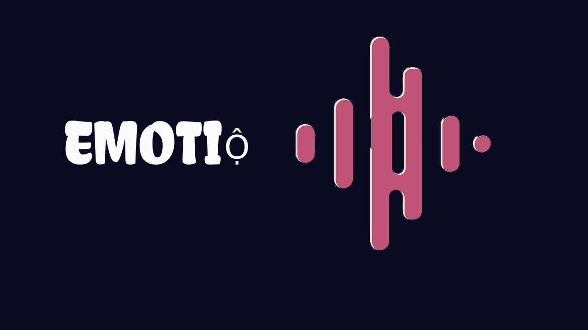

# <center> EmotiỘ </center> #




### Intelligent emotion recognition and music recommendation ##


---
## Docker  ##

> pull from docker registry


```bash  
docker pull holychicken99/emotio:0.1
```
### To run 
#### For Linux ####

```bash
docker run -it -p 5000:5000 --device /dev/video0 holychicken99/emotio:0.1 
```
---
> :warning: Manual Build works only on Linux  OS !
### Run Locally
Clone the project

```bashD
  git clone https://link-to-project
```

Go to the project directory

```bash
  cd CLI
```

Install dependencies

```bash
  pip install -r requirements.txt
```

Start the server

```bash
    python3 backend.py
```

  
---

<details>
<summary> <strong><font size="+2"> Screenshots </font></strong/></summary>
  <br>
  


  
## License

[MIT](https://choosealicense.com/licenses/mit/)

</details> 

--- 
### Dependencies 

**Client:** `tailwind`

**Server:** `python3`, ` flask`, `open-cv` 

  
